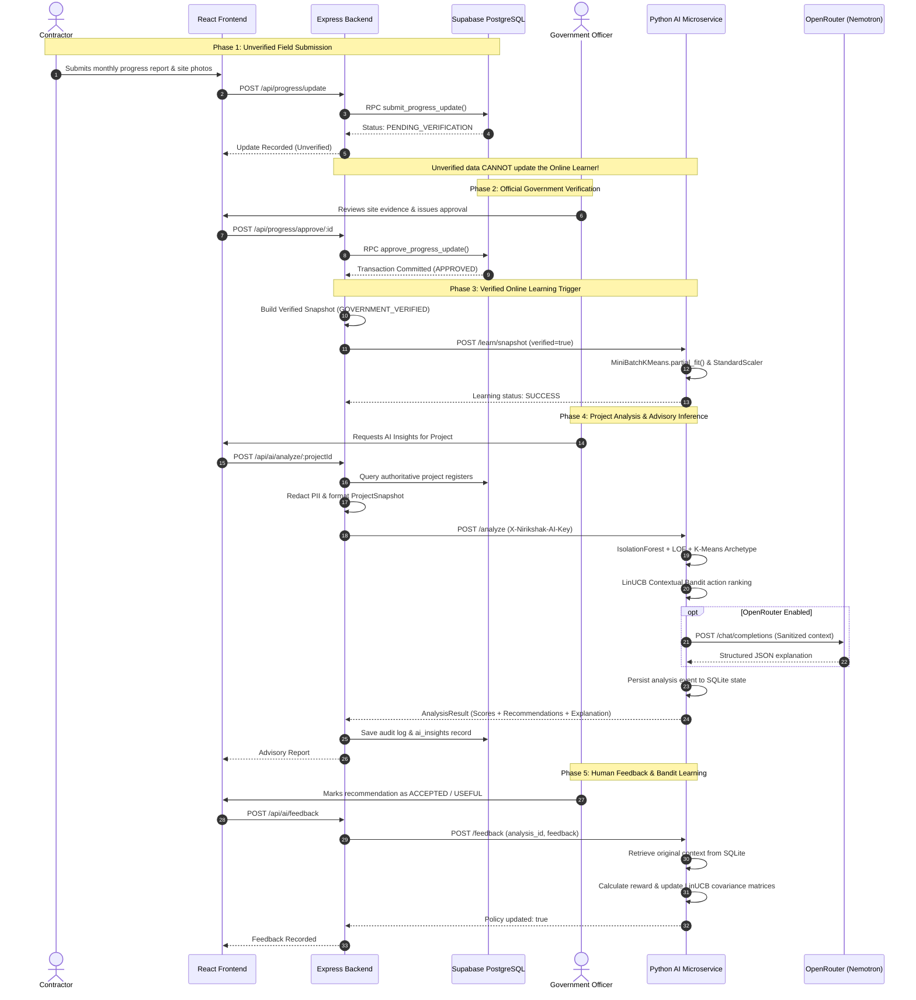

# NIRIKSHAK AI Data Flow & Lifecycle Specification

**Version:** 1.0.0  
**Status:** Implemented & Verified  

---

## 1. End-to-End Operational Lifecycle

The NIRIKSHAK AI lifecycle enforces strict integrity checks at every state boundary. The sequence below details the full progression from field submission to continuous model refinement:

---

## 2. Telemetry Provenance Taxonomy

Every data point entering the AI context builder is tagged with its provenance tier:

| Provenance Tag | Source | Trust Level | May Train Online Model? |
|---|---|---|---|
| `DATABASE_FACT` | Official tenders, sanctioned budgets, legal awards | Absolute | Yes |
| `CONTRACTOR_REPORTED` | Contractor self-reported progress, claims, delay reasons | Unverified Claim | **STRICTLY NO** |
| `GOVERNMENT_VERIFIED` | Executive Engineer field inspections, approval notes | Verified Fact | **YES** |
| `PUBLIC_EXTERNAL` | Public complaints, weather anomalies, GIS markers | Contextual | Only aggregated counts |
| `AI_INFERENCE` | Anomaly scores, archetype clusters, recommended actions | Advisory Model Output | No |

---

## 3. Human-in-the-Loop Feedback Rewards

LinUCB contextual bandit actions receive numerical reinforcement rewards based on human officer review and subsequent verified project outcomes:

| Government Feedback | Reward ($r$) | Effect on Policy Matrix |
|---|---|---|
| `ACCEPTED` | $+1.0$ | Strongly reinforces action weights for similar feature contexts |
| `USEFUL` | $+0.8$ | Moderately reinforces action weights |
| `NEUTRAL` | $0.0$ | Leaves baseline weights neutral |
| `REJECTED` | $-0.5$ | Deprioritizes action for similar project contexts |
| `HARMFUL` | $-1.0$ | Strongly penalizes action selection for similar contexts |

Future outcome indicators (such as reduced schedule variance or lower cost overruns over consecutive verified milestones) contribute up to $+0.5$ additional outcome reward.
