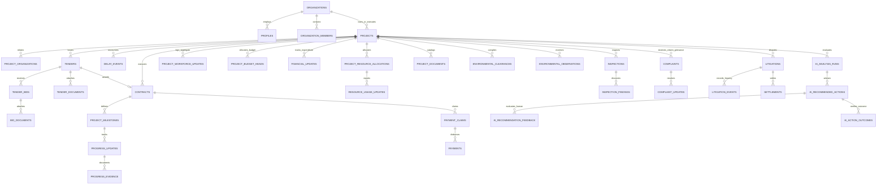

# NIRIKSHAK Database V2 Architecture

## 1. Executive Summary & Design Principles

NIRIKSHAK Database V2 establishes Supabase PostgreSQL as the authoritative single source of truth for the entire infrastructure project lifecycle:
**Government Registration → Project Creation → Tender Publication → Contractor Bidding → Contract Award → Execution & Milestones → Progress Reports → Government Verification → Resources & Workforce → Financial & Payment Claims → Inspections → Environmental Compliance → Citizen Grievances → Litigation & Settlement → AI Decision-Support → Continuous Learning → Project Completion & Public Transparency.**

### Foundational Principles:
1. **Authoritative Backend**: Supabase PostgreSQL is the sole source of truth. Frontend React state is ephemeral UI presentation and never authoritative.
2. **Reported vs. Verified Segregation**: Contractor-submitted information (`reported_progress`, claimed payment amounts, contractor resource usage) remains strictly distinguished from Government-verified facts (`verified_progress`, approved claim amounts, certified physical progress).
3. **Multi-Tenant Government & Contractor Isolation**:
   - Government users cannot access or tamper with projects belonging to other Government organizations unless granted global administrative or audit authority.
   - Contractors cannot access competitor bids, private pricing proposals, or unassigned projects.
   - Citizens see only sanitized, approved, public information via dedicated views.
4. **Separation of Powers & Role Enforcement**:
   - Contractors cannot approve their own progress, certify inspections, or approve their own payment claims.
   - Government approvals and contract awards execute exclusively via atomic, audited `SECURITY DEFINER` functions with `search_path = public, pg_temp`.
5. **AI Advisory Role & Privacy**:
   - AI recommendations provide decision support; AI cannot execute state transitions, approve claims, or modify official progress directly.
   - Sensitive PII (citizen Aadhaar, PAN, contact numbers) and confidential pricing are masked before AI analysis.
   - Unknown values remain `NULL` (never fabricated zero).
6. **Data Integrity & Immutability**:
   - All legacy migrations `001` through `028` are strictly immutable production history.
   - All Database V2 enhancements begin at `029` through `046`.
   - Soft deletions (`deleted_at`) protect auditability for high-impact contracts, projects, and tenders.

---

## 2. Multi-Domain Entity Relationship Overview

---

## 3. High-Traffic & Performance Strategy
- **Index Layer**: Composite indexes on `(government_organization_id, normalized_status)`, `(project_id, verification_status)`, `(project_id, created_at DESC)`, and `(recipient_user_id, read_at)` ensure sub-millisecond lookups on primary dashboards.
- **Controlled Realtime**: Publication to `supabase_realtime` is enabled strictly on actionable notification and workflow entities (`notifications`, `progress_updates`, `payment_claims`, `complaint_updates`, `tenders`, `projects`), protected by database RLS.
