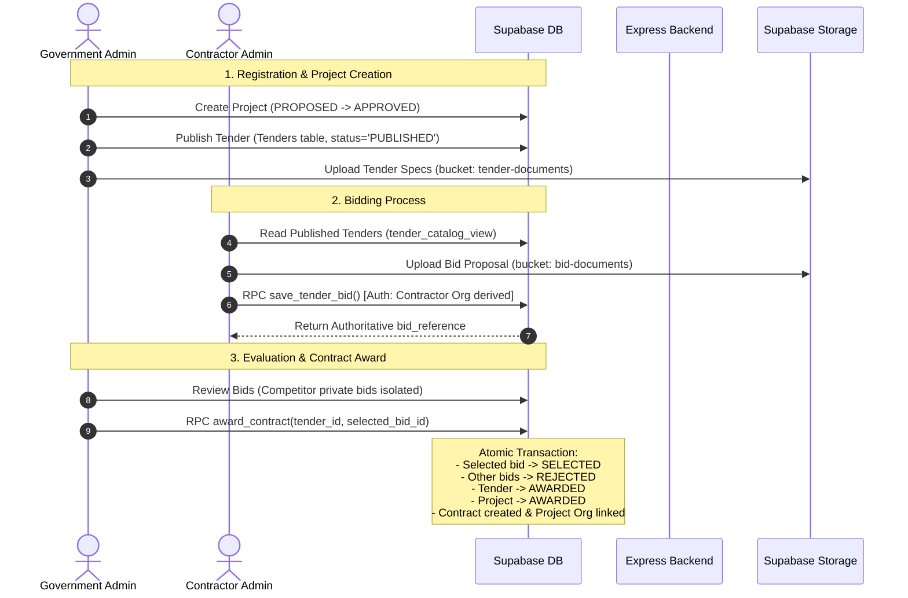
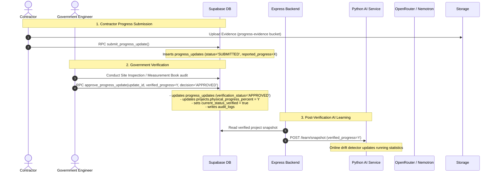
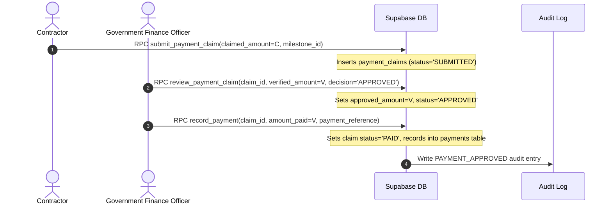

# NIRIKSHAK Database V2 Data Flow Architecture

This document maps the complete operational data flows across the infrastructure project lifecycle.

---

## 1. Project Registration & Procurement Lifecycle



---

## 2. Execution, Progress & AI Verification Flow



---

## 3. Financial Monitoring, Payment Claims & Disbursements



---

## 4. Reinforcement Learning Advisory & Outcome Loop

```mermaid
sequenceDiagram
    autonumber
    actor GovUser as Government Official
    participant Express as Express Backend
    participant Supabase as Supabase DB
    participant PythonAI as Python AI Service
    participant LinUCB as LinUCB Policy

    Note over GovUser, PythonAI: 1. AI Decision Support
    GovUser->>Express: Request Project AI Analysis
    Express->>Supabase: Build Sanitized Context (honest NULLs, zero fake zeroes)
    Express->>PythonAI: POST /analyze
    PythonAI->>LinUCB: Rank recommended interventions
    PythonAI-->>Express: Return Anomaly Scores & Recommended Actions
    Express->>Supabase: Persist into ai_analysis_runs & ai_recommended_actions
    Express-->>GovUser: Display Risk Bands & Interventions

    Note over GovUser, PythonAI: 2. Government Feedback (Human Judgment)
    GovUser->>Express: Submit Action Feedback (USEFUL / ACCEPTED / HARMFUL)
    Express->>Supabase: Persist into ai_recommendation_feedback
    Express->>PythonAI: POST /feedback
    Note over PythonAI: Stores human feedback in SQLite; DOES NOT finalize policy

    Note over GovUser, LinUCB: 3. Downstream Verified Outcome (Final Learning)
    GovUser->>Supabase: Record subsequent Verified Progress & Milestone clearance
    Express->>PythonAI: POST /learn/outcome (baseline vs verified outcome delta)
    PythonAI->>LinUCB: policy.update(context, action, reward) [ONCE per outcome]
    Express->>Supabase: Persist into ai_action_outcomes
```
